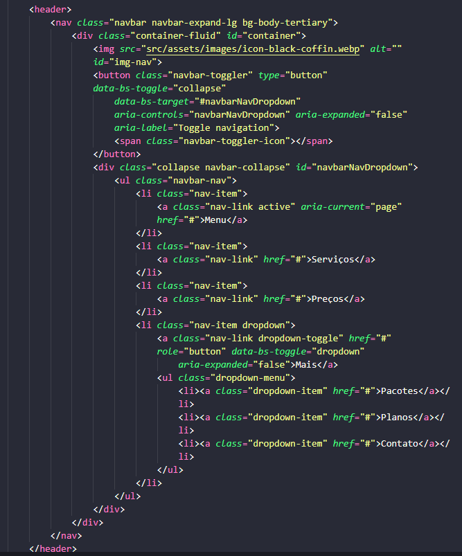

# PoC – Bootstrap 5: Grid, Componentes, Responsividade

> **Aluno: João Pedro de Queiroz Leite**
>
> **Turma:Desenvolvedor Front-end**
>
> **Data:13/06/2025**

---

## 1. Introdução

O framework Bootstrap, é uma ferramente que auxilia em projetos que exigem uma responsividade e agilidade. Todos os componentes por si só já tem responsividade, logo é uma preocupação a menos. Muito prático de se ser utilizado, não necessitando um nível muito avançado de conhecimentos de front-end para usá-lo. Muitos projetos legados (projetos já existentes) ainda utilizam deste framework, mesmo ele tendo perdido popularidade e até funcionalidades, se comparado com o Tailwind CSS que surgiu como algo mais moderno.

---

## 2. Aplicações e Benefícios

- ### Onde esse conceito é utilizado?
  É usado na contrução de páginas web completas, lading pages, trabalhos pessoais, trabalhos institucionais e até portfólio.
- ### Quais problemas ele resolve?
  Ele resolve problemas como
  - Falta de padronização entre sites;
  - A dificuldade de criar layouts responsivos do zero;
  - Repetição de código para elementos comuns, como botões, alertas, etc.
- ### Quais são as vantagens?
  Suas vantagens são as seguintes
  - Layout responsivo pronto com o sistem grid;
  - Variedade de componentes prontos;
  - Customização com classes utilitárias;
  - Integração simples com projetos existentes.

---

## 3. Diferenças e Comparações

### Bootstrap x CSS Puro

    Para você fazer um botão com um CSS puro, seria trabalhoso quando se pensa em um site com várias páginas ou até mesmo uma navbar para cada dispositivo que fosse acessar o site. Neste momento entra o Bootstrap, com apenas as váriaveis criadas por ele, você já tem tudo feito e com animações, apenas copiando e colando o código dado por eles, por isso ele foi tão popular em sua época. Exigindo mais planejamento e conhecimento.

### Bootstrap x Tailwind CSS

    Tailwind é baseado em utilitários (classes únicas por estilo), o que dá mais liberdade, mas exige mais controle visual manual. Bootstrap oferece uma solução mais "pronta para uso", ideal para quem quer agilidade ou está começando.

---

## 4. Exemplo Prático

    

    
    

        <h5 class="card-title">Card title</h5>
        
Some quick example text to build on the card title and make up the bulk of the card’s content.

        <a href="#" class="btn btn-primary">Go somewhere</a>
    

    

### Explicação:

---

## 5. Conclusão

Resumo do que aprendeu e recomendações.

---

## 6. Fontes utilizadas

- (https://getbootstrap.com/docs/5.3/getting-started/introduction/)

- (https://www.youtube.com/watch?v=lXS8PIDmG_E&t=50s)

---

## 7. Slides da Apresentação

📎 Link para os slides:
[slides.com/seunome/tema](https://)

---

## Checklist de Entrega

- [x] Markdown com conteúdo autoral
- [x] Código funcional incluído
- [x] Fontes listadas
- [x] Slides prontos
- [x] Arquivo no GitHub

Projetos legado (Projetos já existentes que precisam de manutenção ou atualizações);
